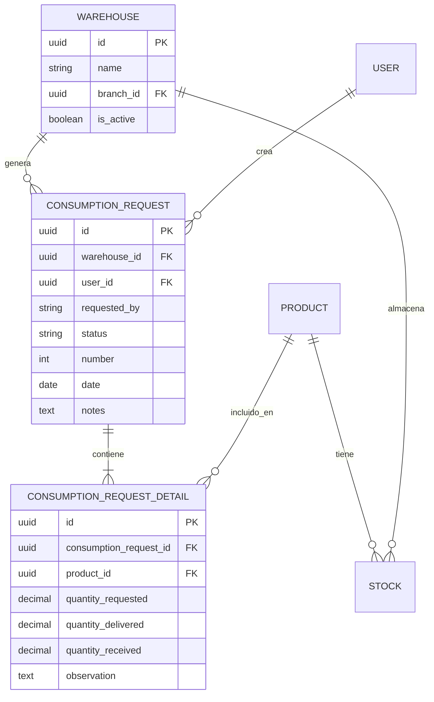

# Diagramas Entidad-Relación (ERD)

## When to use this skill
- Cuando el usuario solicita diseñar o documentar la estructura de una base de datos.
- Cuando se necesita modelar entidades, relaciones y atributos antes de crear migraciones en Laravel.
- Cuando se detecta un problema de lógica en la base de datos y se requiere análisis mediante un diagrama ER.
- Cuando se trabaja en ingeniería inversa de una base de datos existente (por ejemplo, al documentar el esquema de `inventory_gclaure`).
- Cuando el usuario necesita planificar nuevas tablas, relaciones Eloquent o índices en PostgreSQL.
- Cuando se debe explicar a nivel conceptual, lógico o físico cómo se relacionan los modelos del sistema.
- Cuando se crean nuevos módulos del ERP (compras, consumos, transferencias, kardex, etc.) y se requiere un mapa de datos previo.

---

## How to use it

### 1. Definición del Alcance y Propósito

Antes de trazar cualquier diagrama, se debe responder:
- ¿Qué módulo o proceso se está modelando? (ej: Solicitudes de Consumo Interno)
- ¿Qué nivel de detalle se necesita? (conceptual, lógico o físico)
- ¿Hay tablas o modelos existentes en Laravel que deben incluirse?

```
Nivel Conceptual  → Vista de alto nivel, sin atributos, solo entidades y relaciones principales.
Nivel Lógico      → Entidades + atributos + tipos de datos + cardinalidad. Independiente del motor de BD.
Nivel Físico      → Reflejo directo del esquema SQL: tablas, columnas, PKs, FKs, índices, tipos PostgreSQL.
```

---

### 2. Componentes Obligatorios de un ERD

#### Entidades
- Representan "cosas" del mundo real: objetos, personas, eventos o conceptos.
- En Laravel corresponden a **Modelos Eloquent** y a sus tablas en PostgreSQL.
- Se dibujan como **rectángulos**.
- Se nombran en **sustantivo singular** y en **MAYÚSCULAS** (ej: `PRODUCTO`, `ALMACÉN`, `USUARIO`).

**Categorías de entidades:**
| Tipo | Descripción | Ejemplo |
|------|-------------|---------|
| Fuerte | Se identifica por sus propios atributos | `PRODUCTO` (tiene `id` propio) |
| Débil | Depende de otra entidad para identificarse | `DETALLE_PEDIDO` (depende de `PEDIDO`) |
| Asociativa | Representa la relación muchos-a-muchos | `SOLICITUD_DETALLE` |

#### Atributos
- Propiedades de una entidad o de una relación.
- En Laravel corresponden a las columnas de la migración.
- Se representan como **óvalos** conectados a la entidad.

**Tipos de atributos:**
| Tipo | Descripción | Ejemplo |
|------|-------------|---------|
| Simple | Valor atómico, no divisible | `precio`, `nombre` |
| Compuesto | Tiene sub-atributos | `dirección` → (calle, ciudad, CP) |
| Derivado | Calculado de otro atributo | `edad` (derivada de `fecha_nacimiento`) |
| Multivaluado | Puede tener múltiples valores | `teléfonos[]` |
| Clave Primaria | Identifica unívocamente la entidad | `id` (UUID en este proyecto) |
| Clave Foránea | Referencia a otra entidad | `warehouse_id`, `user_id` |

#### Relaciones
- Representan cómo interactúan las entidades.
- En Laravel corresponden a los métodos de relación Eloquent (`hasMany`, `belongsTo`, etc.).
- Se representan como **rombos** o etiquetas sobre las líneas de conexión.
- Se nombran como **verbos** (ej: `TIENE`, `PERTENECE_A`, `SOLICITA`, `DESPACHA`).

---

### 3. Cardinalidad — Reglas y Notaciones

La cardinalidad define cuántas instancias de una entidad se relacionan con otra.

#### Tipos de Cardinalidad

| Relación | Ejemplo Real | Eloquent |
|----------|-------------|---------|
| **1:1** (Uno a uno) | Un `USUARIO` tiene un `PERFIL` | `hasOne` / `belongsTo` |
| **1:N** (Uno a muchos) | Un `ALMACÉN` tiene muchos `STOCKS` | `hasMany` / `belongsTo` |
| **N:M** (Muchos a muchos) | `PRODUCTOS` en múltiples `CATEGORÍAS` | `belongsToMany` |

#### Notación Patas de Gallo (crow's foot) — Estándar del proyecto

```
Una línea simple   ──       = exactamente uno
Pata de gallo      ──<      = muchos
Círculo            ──o      = cero (opcional)
```

Combinaciones comunes:
```
Uno y solo uno:    ──||──
Cero o uno:        ──o|──
Uno o muchos:      ──|<──
Cero o muchos:     ──o<──
```

---

### 4. Claves de Entidad

| Tipo | Descripción |
|------|-------------|
| **Clave Primaria (PK)** | Identifica unívocamente cada registro. En este proyecto: UUIDs. |
| **Clave Foránea (FK)** | Referencia la PK de otra tabla. Siempre con índice. |
| **Clave Candidata** | Cualquier atributo que podría ser PK (ej: `email`, `code`) |
| **Superclave** | Conjunto de atributos que identifican de forma única (PK + otros) |

---

### 5. Convenciones del Proyecto Laravel + PostgreSQL

Al documentar o crear un ERD para este proyecto se deben respetar estas convenciones:

#### Nomenclatura de tablas y columnas
```
- Tablas:     snake_case, plural          → warehouses, consumption_requests
- Columnas:   snake_case                  → warehouse_id, requested_by, created_at
- PKs:        UUID (uuid tipo PostgreSQL)  → id UUID PRIMARY KEY DEFAULT gen_random_uuid()
- FKs:        entidad_id (uuid)            → warehouse_id UUID REFERENCES warehouses(id)
- Timestamps: created_at, updated_at      → Automáticos por Eloquent
- Soft delete: deleted_at                 → cuando aplica
```

#### Índices obligatorios (PostgreSQL)
Siempre crear índices para:
- Claves foráneas (`warehouse_id`, `user_id`, `product_id`)
- Campos de búsqueda frecuente (`email`, `code`, `document_number`, `phone`)
- Campos de filtro en listados (`status`, `date`, `number`)

```sql
-- Ejemplo de migración Laravel con índices correctos
Schema::create('consumption_requests', function (Blueprint $table) {
    $table->uuid('id')->primary();
    $table->uuid('warehouse_id');
    $table->uuid('user_id');
    $table->string('requested_by', 100)->nullable();
    $table->string('status', 50)->default('pendiente');
    $table->unsignedBigInteger('number');
    $table->date('date');
    $table->text('notes')->nullable();
    $table->timestamps();

    $table->foreign('warehouse_id')->references('id')->on('warehouses');
    $table->foreign('user_id')->references('id')->on('users');
    $table->index('status');
    $table->index('number');
    $table->index('date');
});
```

---

### 6. Pasos para Dibujar un ERD en este Proyecto

**Paso 1 — Identificar Entidades**
Listar todos los modelos Eloquent del módulo que se está analizando:
```
USUARIO → User.php
ALMACÉN → Warehouse.php
PRODUCTO → Product.php
STOCK → Stock.php
SOLICITUD_CONSUMO → ConsumptionRequest.php
DETALLE_SOLICITUD → ConsumptionRequestDetail.php
```

**Paso 2 — Identificar Atributos Clave**
Para cada entidad, listar PKs, FKs y atributos principales del `$fillable`.

**Paso 3 — Definir Relaciones**
Mapear los métodos de relación Eloquent como relaciones en el ERD:
```php
// Un almacén tiene muchos stocks
public function stocks(): HasMany {
    return $this->hasMany(Stock::class);
}

// ERD: ALMACÉN ──|<── STOCK (1 a muchos)
```

**Paso 4 — Definir Cardinalidad**
Establecer si cada relación es 1:1, 1:N o N:M.

**Paso 5 — Agregar Restricciones**
Documentar si las relaciones son obligatorias (mínimo 1) u opcionales (mínimo 0).

**Paso 6 — Representar en Texto (Mermaid)**
Para documentar ERDs en el proyecto se usa la notación **Mermaid ERD**:



---

### 7. Mapeo de Lenguaje Natural a Componentes ERD

Siguiendo el enfoque de Peter Chen (1976):

| Componente Gramatical | Componente ERD | Ejemplo |
|-----------------------|---------------|---------|
| Sustantivo común | Tipo de Entidad | `producto`, `almacén` |
| Sustantivo propio | Instancia de Entidad | `Almacén Central` |
| Verbo | Tipo de Relación | `solicita`, `despacha`, `tiene` |
| Adjetivo | Atributo de Entidad | `activo`, `pendiente` |
| Adverbio | Atributo de Relación | `parcialmente`, `completamente` |

---

### 8. Modelos Relacionales del Proyecto (Referencia Rápida)

El esquema del ERP `inventory_gclaure` incluye los siguientes grupos de entidades:

#### Inventario
```
PRODUCT ──N:M── CATEGORY     (tabla pivot: category_product)
PRODUCT ──1:N── STOCK        (stock por almacén)
PRODUCT ──1:N── KARDEX       (movimientos históricos)
WAREHOUSE ──1:N── STOCK
WAREHOUSE ──N:1── BRANCH
```

#### Compras y Solicitudes
```
PURCHASE ──1:N── PURCHASE_DETAIL
PURCHASE_ORDER ──1:N── PURCHASE_ORDER_DETAIL
CONSUMPTION_REQUEST ──1:N── CONSUMPTION_REQUEST_DETAIL
CONSUMPTION_REQUEST_DETAIL ──N:1── PRODUCT
```

#### Ventas
```
SALE ──1:N── SALE_DETAIL
QUOTATION ──1:N── QUOTATION_DETAIL
SALE_DETAIL ──N:1── PRODUCT
```

#### Seguridad y Usuarios
```
USER ──N:M── ROLE       (spatie/laravel-permission)
ROLE ──N:M── PERMISSION
USER ──N:1── BRANCH     (sede activa)
```

---

### 9. Limitaciones de los ERD — A Tener en Cuenta

- Un ERD **solo muestra estructura relacional**, no lógica de negocio (esa va en Services/Actions).
- Los ERD son para **datos estructurados**. No aplican para datos no estructurados (JSON libre).
- Al integrar con una BD existente, verificar siempre el esquema actual con `php artisan migrate:status` antes de proponer cambios.
- Un mismo proceso puede tener enfoques ERD válidos diferentes; lo importante es que sea coherente con los modelos Laravel existentes.

---

### 10. Checklist de Validación de un ERD

Antes de crear migraciones o modificar el esquema, validar:

- [ ] Todas las entidades tienen PK definida (UUID en este proyecto)
- [ ] Todas las FKs tienen índice correspondiente
- [ ] Las relaciones N:M tienen tabla pivot correctamente nombrada
- [ ] La cardinalidad mínima está definida (obligatoria vs. opcional)
- [ ] Los atributos derivados **no se almacenan** en BD (se calculan en Accessors o Resources)
- [ ] Las entidades débiles tienen FK compuesta o dependencia correctamente reflejada
- [ ] El ERD es coherente con los modelos Eloquent existentes (`$fillable`, relaciones, `$casts`)
- [ ] Los campos de búsqueda frecuente tienen índice en PostgreSQL

---

### 11. Recursos de Referencia

- Lucidchart — ¿Qué es un diagrama entidad-relación?: https://www.lucidchart.com/pages/es/que-es-un-diagrama-entidad-relacion
- Mermaid ERD Docs: https://mermaid.js.org/syntax/entityRelationshipDiagram.html
- Laravel Eloquent Relationships: https://laravel.com/docs/eloquent-relationships
- PostgreSQL Indexes: https://www.postgresql.org/docs/current/indexes.html
- Peter Chen (1976) — "The Entity-Relationship Model": artículo fundacional del modelado ER
